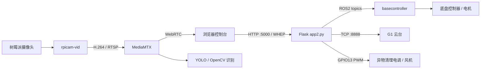

# GIS 管内壁爬行机器人控制端（v1.0.1）

本目录是运行在树莓派上的机器人上位控制程序。系统通过浏览器提供低延迟视频、底盘运动、自动避障、异物识别与清理、G1 云台、拍照录像和安全关机等功能。

> 本项目会直接驱动电机、风机和云台。首次部署必须在机器人悬空、清理风机卸除叶片或断开动力电源的条件下完成联调。确认停止、断网和程序退出时均能可靠停机后，再进入 GIS 管道测试。

## 系统组成



主要功能：

- 树莓派摄像头 H.264 推流，MediaMTX 提供 WebRTC/WHEP 低延迟预览。
- 拍照与 MP4 录像，文件保存在树莓派本地并可通过网页下载。
- YOLOv8 普通检测框和 OBB 旋转框识别，识别框由浏览器 Canvas 叠加。
- 基于 YOLO 孔洞位置的自动避障：直行、左螺旋、右螺旋。
- 独立的 OpenCV 小异物识别：局部异常、边缘和背景变化多算法投票。
- ROS2 底盘启停、手控/自动模式、速度、方向和底层风扇调速。
- G1 云台 TCP 控制：抬头、低头、左转、右转、读取姿态和视角重置。
- GPIO13 电调风机控制，用于异物清理。
- CPU 温度/负载/内存、视频、识别、机器人和云台状态监控。
- 一键停止相关进程并安全关闭树莓派。

## 目录结构

```text
v1.0.1/
├── app2.py                 # Flask 后端、视频、识别、ROS2、GPIO 和云台控制
├── templates/
│   └── index1.html         # 浏览器控制界面（CSS/JavaScript 均内嵌）
├── README.md
└── runtime/                # 首次启动自动创建
    ├── captures/           # JPG 照片和 MP4 录像
    ├── mediamtx.yml        # 运行时生成，不要手工维护
    ├── mediamtx.log
    ├── publisher.log
    ├── recording.log
    └── basecontroller.log
```

`best.pt`、MediaMTX、`/opt/rpi-cam-stack` 和 ROS2 `basecontroller` 不包含在本目录中，需要单独部署。

## 运行前必检

### 1. 首页模板入口

当前版本已修正首页模板入口。`app2.py` 的 `/` 路由直接渲染本目录提供的 `templates/index1.html`：

```python
@app.route("/")
def index():
    return render_template("index1.html")
```

`render_template` 已经在文件顶部导入，不需要增加新的依赖或复制 HTML 文件。

### 2. 核对硬件

| 设备 | 当前代码约定 |
| --- | --- |
| 树莓派 | 64 位 Linux；摄像头运行栈固定在 `/opt/rpi-cam-stack` |
| 树莓派摄像头 | 由 `/opt/rpi-cam-stack/bin/rpicam-vid` 采集 |
| 底盘控制器 | 由外部 ROS2 包 `basecontroller` 连接和控制 |
| G1 云台 | 默认 IP `172.20.10.8`，TCP 控制端口 `8888` |
| 异物清理电调 | BCM GPIO13，即物理 33 脚；50 Hz PWM |
| 电调 PWM | 1000 us 为停止/最低油门，2000 us 为最高油门 |

电调和树莓派必须共地，风机动力电源不能直接由树莓派 5 V 引脚供电。代码启动时会持续输出 1000 us 解锁信号；点击“异物清理”后先以 70% 油门助推 0.5 秒，再缓降到 60%。这些值目前是 `app2.py` 内的常量，不是环境变量。

界面的两个风机入口不是同一执行器：

- “异物清理”控制树莓派 GPIO13 上的本地电调风机。
- “机器人风扇速度”向 ROS2 `/fan_speed` 发布 `0~180` 的整数。

### 3. G1 云台默认模式

v1.0.1 增加了 G1 默认模式维护机制。默认配置为 `G1_DEFAULT_MODE=3`（全跟随模式），并由后台 watchdog 在启动后低频查询；发现云台模式被改变时，会在没有进行中的云台动作时恢复默认模式，默认检查周期为 15 秒。

- 需要默认锁定模式时设置 `G1_DEFAULT_MODE=0`。
- 需要完全由人工管理模式时设置 `G1_DEFAULT_MODE_ENABLED=0`。
- 手动调用 `/api/gimbal/mode` 改成其他模式后，如果 watchdog 仍启用，模式可能在下一次检查时恢复为默认模式。
- `G1_AUTO_LOCK_MODE` 仅为旧配置名保留，v1.0.1 不再读取其环境变量；请改用上面的两个配置项。

模式维护不会执行周期性回中，只在模式查询或恢复时访问 G1；进行中的方向/俯仰/横滚动作会优先完成。程序退出、网页安全关机和清理流程都会停止该 watchdog。

v1.0.1 同时加强了 G1 TCP 协议处理：请求会校验响应命令号并有限度忽略无关响应帧，设置模式后会再次查询确认；多进程部署时使用文件锁串行化 G1 TCP 通信。动作间隔默认缩短为 40 ms，Neutral 和动作完成后的默认等待均为 20 ms，如实机响应不稳定可通过环境变量调大这些值。

## 软件依赖

### 操作系统组件

以下命令以 Debian/Ubuntu 系的 64 位树莓派系统为例：

```bash
sudo apt update
sudo apt install -y \
  python3-venv python3-pip python3-opencv python3-numpy \
  python3-psutil python3-gpiozero \
  ffmpeg iproute2 procps \
  gstreamer1.0-tools gstreamer1.0-plugins-base \
  gstreamer1.0-plugins-good gstreamer1.0-plugins-bad
```

GPIO 后端按系统选择安装。Raspberry Pi OS Bookworm 通常使用 `python3-lgpio`；其他系统可使用与 `gpiozero` 兼容的 `lgpio` 或 `RPi.GPIO`。运行用户还需要 GPIO 访问权限。

### Python 环境

ROS2 的 `rclpy` 通常由系统包提供，因此虚拟环境应保留系统包：

```bash
cd "/path/to/v1.0.1"
python3 -m venv --system-site-packages .venv
source .venv/bin/activate
python -m pip install --upgrade pip
python -m pip install Flask ultralytics
```

主要 Python 模块如下：

| 模块 | 用途 | 是否可降级运行 |
| --- | --- | --- |
| `Flask` | Web 页面和 API | 否 |
| `gpiozero` | GPIO13 电调 PWM | 缺失时仅清理风机不可用 |
| `opencv-python` / 系统 `cv2` | RTSP 取帧和 OpenCV 异物识别 | 缺失时识别和避障不可用 |
| `numpy` | 图像处理 | 缺失时识别和避障不可用 |
| `ultralytics` / `torch` | YOLOv8 孔洞识别 | 缺失时 YOLO 和自动避障不可用 |
| `psutil` | CPU 和内存状态 | 缺失时状态字段降级 |
| `rclpy`、`geometry_msgs`、`std_msgs` | ROS2 机器人控制 | 缺失时底盘控制不可用 |

树莓派上的 PyTorch/Ultralytics 安装方式与系统、Python 版本和 CPU 架构有关。安装后至少确认：

```bash
python -c "import flask, cv2, numpy, gpiozero, psutil, ultralytics; print('Python dependencies OK')"
python -c "import rclpy; from geometry_msgs.msg import Twist; from std_msgs.msg import Int32, String; print('ROS2 Python OK')"
```

## 外部组件部署

### MediaMTX

程序按以下顺序查找 MediaMTX：

1. 环境变量 `MEDIAMTX_BIN`。
2. 系统 `PATH` 中的 `mediamtx`。
3. `v1.0.1/bin/mediamtx`。
4. `v1.0.1/mediamtx`。
5. `/usr/local/bin/mediamtx` 或 `/usr/bin/mediamtx`。

推荐将已验证版本的 ARM64 可执行文件放在 `bin/mediamtx`，并赋予执行权限：

```bash
mkdir -p bin
install -m 0755 /path/to/mediamtx bin/mediamtx
./bin/mediamtx --version
```

当前配置需要 MediaMTX 支持 WebRTC/WHEP，以及 `webrtcIPsFromInterfaces`、`webrtcLocalUDPAddress`、`webrtcLocalTCPAddress` 和 `webrtcICEServers2` 等配置项。升级 MediaMTX 后应先在台架环境验证配置兼容性。

### 树莓派摄像头运行栈

视频发布器使用硬编码路径 `/opt/rpi-cam-stack`，且需要 `rpicam-vid` 支持 `libav`、`libx264` 和低延迟参数。仅在 `PATH` 中安装另一个 `rpicam-vid` 不会被本程序采用。

部署后检查：

```bash
test -x /opt/rpi-cam-stack/bin/rpicam-vid
env \
  LD_LIBRARY_PATH=/opt/rpi-cam-stack/lib/aarch64-linux-gnu \
  LIBCAMERA_IPA_MODULE_PATH=/opt/rpi-cam-stack/lib/aarch64-linux-gnu/libcamera/ipa \
  LIBCAMERA_IPA_PROXY_PATH=/opt/rpi-cam-stack/libexec/libcamera \
  /opt/rpi-cam-stack/bin/rpicam-vid --list-cameras
gst-inspect-1.0 h264parse
gst-inspect-1.0 rtspclientsink
```

### YOLO 权重

默认权重路径为当前目录下的 `best.pt`，本目录未包含该文件：

```bash
cp /path/to/best.pt ./best.pt
test -f ./best.pt
```

也可以通过 `YOLO_MODEL_PATH` 指向其他位置。代码同时兼容普通检测模型和 YOLOv8 OBB 模型；OBB 会转换为外接矩形供前端显示，并保留多边形坐标。

### ROS2 与 basecontroller

本目录不包含 ROS2 工作空间、`basecontroller` 包或底盘固件。启动 Web 程序前必须 source ROS2 和机器人工作空间，因为 `app2.py` 及其子进程会继承当前环境：

```bash
source /opt/ros/<ros-distro>/setup.bash
source /path/to/robot_ws/install/setup.bash
ros2 pkg executables basecontroller
```

最后一条命令应能看到 `basecontroller basecontroller`。网页点击“启动”后，后端实际执行：

```bash
ros2 run basecontroller basecontroller
```

### ROS2 接口约定

| Topic | 类型 | 方向 | 说明 |
| --- | --- | --- | --- |
| `/cmd_vel` | `geometry_msgs/msg/Twist` | 发布 | `linear.x` 控制前后，`angular.z` 控制转向/避障偏航 |
| `/fan_speed` | `std_msgs/msg/Int32` | 发布 | 底层风扇速度 `0~180`，界面每次增减 10 |
| `/robot_mode` | `std_msgs/msg/Int32` | 发布 | 控制模式和自动轨迹位编码 |
| `/controller_state` | `std_msgs/msg/String` | 订阅 | 可选底层状态，支持 JSON 或 `key=value` 文本 |

`/robot_mode` 当前编码：

| 值 | 含义 |
| ---: | --- |
| `0` | 手控模式 |
| `1` | 自动模式 + 直线 |
| `3` | 自动模式 + 左螺旋 |
| `5` | 自动模式 + 右螺旋 |

底盘线速度范围为 `0.00~0.50 m/s`，默认 `0.00 m/s`；角速度默认 `0.5 rad/s`。若已经启动底层但机器人不动，先检查速度是否仍为 0。

## 网络与端口

| 端口 | 协议 | 用途 |
| ---: | --- | --- |
| `5000` | TCP | Flask 控制页面和 API |
| `8889` | TCP | MediaMTX WebRTC/WHEP HTTP 接口及兼容页面 |
| `8189` | UDP | WebRTC ICE 媒体传输 |
| `8190` | TCP | WebRTC ICE TCP 回退 |
| `8554` | TCP | 本地 RTSP 流 `rtsp://127.0.0.1:8554/cam`；当前 MediaMTX 配置会监听所有接口 |
| `8888` | TCP，树莓派主动连接 | G1 云台控制，默认目标 `172.20.10.8` |

浏览器与树莓派应处于可直达的可信局域网。ROS2 DDS 还会使用由所选 RMW 实现决定的动态端口。

## 配置项

常用环境变量：

| 变量 | 默认值 | 说明 |
| --- | --- | --- |
| `MEDIAMTX_BIN` | 自动查找 | MediaMTX 可执行文件路径 |
| `MEDIAMTX_LOG_LEVEL` | `info` | `error`、`warn`、`info` 或 `debug` |
| `FFMPEG_BIN` | 自动查找 | FFmpeg 可执行文件路径 |
| `WEBRTC_NETWORK_WATCH_INTERVAL_SECONDS` | `5` | 网卡地址变化检查周期，最小 3 秒 |
| `G1_CAMERA_IP` | `172.20.10.8` | G1 云台 IP |
| `G1_CONTROL_PORT` | `8888` | G1 TCP 控制端口 |
| `G1_CONNECT_TIMEOUT` | `2.0` | TCP 连接超时，秒 |
| `G1_RESPONSE_TIMEOUT` | `2.0` | 命令响应超时，秒 |
| `G1_PULSE_DURATION_MS` | `250` | 云台单击动作持续时间，限制为 80~800 ms |
| `G1_DEFAULT_MODE` | `3` | G1 默认模式：`0` 锁定、`1` 航向跟随+俯仰锁定、`2` 航向跟随+俯仰跟随、`3` 全跟随 |
| `G1_DEFAULT_MODE_ENABLED` | `1` | 是否启用后台默认模式 watchdog；设为 `0` 后由人工管理 G1 模式 |
| `G1_MODE_START_DELAY_SECONDS` | `0.20` | watchdog 启动后的首次检查延迟，秒 |
| `G1_MODE_VERIFY_INTERVAL_SECONDS` | `15.0` | watchdog 在线检查周期，秒，范围 5~300 |
| `G1_MODE_APPLY_DELAY_SECONDS` | `0.08` | 设置模式后再次查询前的等待时间，秒 |
| `G1_MAX_UNRELATED_RESPONSE_FRAMES` | `6` | 单次 TCP 请求最多忽略的无关响应帧数量 |
| `G1_COMMAND_MIN_INTERVAL` | `0.04` | G1 TCP 命令之间的最小间隔，秒 |
| `G1_NEUTRAL_SETTLE_SECONDS` | `0.02` | 云台动作前 Neutral 的等待时间，秒 |
| `G1_POST_ACTION_SETTLE_SECONDS` | `0.02` | 云台动作完成后的等待时间，秒 |
| `G1_AUTO_LOCK_MODE` | 不再读取 | v1.0.0 兼容配置名；v1.0.1 请使用 `G1_DEFAULT_MODE` 和 `G1_DEFAULT_MODE_ENABLED` |
| `G1_YAW_DIRECTION` | `1` | 航向方向反向时设为 `-1` |
| `G1_PITCH_DIRECTION` | `-1` | 俯仰方向反向时改为 `1` |
| `DETECTION_BACKEND` | `yolov8` | 自动避障要求保持为 `yolov8` |
| `YOLO_MODEL_PATH` | `best.pt` | YOLO 权重路径，相对路径以本目录为基准 |
| `YOLO_IMGSZ` | `416` | YOLO 推理尺寸 |
| `YOLO_CONF` | `0.35` | 置信度阈值 |
| `YOLO_IOU` | `0.45` | NMS IoU 阈值 |
| `YOLO_DEVICE` | `cpu` | 推理设备 |
| `YOLO_PROCESS_WIDTH` | `640` | 推理前缩放宽度 |
| `YOLO_NUM_THREADS` | `2` | PyTorch CPU 线程数，`0` 表示不主动设置 |
| `YOLO_FORCE_LABEL` | 空 | 强制覆盖模型类别显示名 |
| `DETECTION_WORKER_FPS` | `4` | 后台识别目标帧率 |

OpenCV 小异物识别还支持 `FOREIGN_DETECTION_MIN_AREA`、`FOREIGN_DETECTION_MAX_AREA`、`FOREIGN_LOCAL_DIFF`、`FOREIGN_EDGE_THRESHOLD`、`FOREIGN_BG_THRESHOLD`、`FOREIGN_VOTE_REQUIRED`、`FOREIGN_FUSION_IOU` 和 `FOREIGN_BG_WARMUP_FRAMES` 等高级参数。建议先采集现场视频，再离线评估后调整，避免在真实管道内直接试阈值。

`WEBRTC_ADDITIONAL_HOSTS` 虽然会参与当前版本的地址监测列表，但生成的 MediaMTX 配置会明确写入 `webrtcAdditionalHosts: []`，因此不能依赖该变量发布额外 ICE 地址。

## 启动

```bash
cd "/path/to/v1.0.1"
source /opt/ros/<ros-distro>/setup.bash
source /path/to/robot_ws/install/setup.bash
source .venv/bin/activate

export G1_CAMERA_IP=172.20.10.8
export YOLO_MODEL_PATH="$PWD/best.pt"
export MEDIAMTX_BIN="$PWD/bin/mediamtx"

python app2.py
```

正常启动时终端会打印本机访问地址和局域网访问地址。浏览器打开：

```text
http://<树莓派IP>:5000
```

程序启动时会依次尝试初始化 GPIO 清理风机、网络地址监测、G1 默认模式 watchdog、MediaMTX/摄像头推流、YOLO 识别线程和 ROS2 节点。部分组件失败时 Flask 仍可能继续运行，应查看启动输出和 `/api/logs`，不能仅以网页能打开作为整机就绪依据。

默认视频参数为 `1280x720 @ 15 FPS`。界面/API 支持：

- 分辨率：`640x360`、`1280x720`、`1920x1080`。
- 帧率：`15`、`24`、`30`、`45`、`60` FPS。

录像期间不能切换分辨率、帧率或重启推流。

## 推荐操作顺序

1. 断开风机动力或卸除叶片，将机器人悬空，确认急停/总电源可随时切断。
2. 启动程序并打开网页，确认视频、G1 云台和系统状态正常。
3. 将底盘速度设为一个很小的非零值，再点击机器人“启动”。
4. 在手控模式下逐项验证前进、后退、左右转和停止，松开方向键后确认速度指令归零。
5. 分别验证 ROS2 `/fan_speed` 和 GPIO13 “异物清理”，不要把两者当成同一风机。
6. 验证 YOLO 画框稳定后再切换自动模式。点击“自动避障”会自动启动底层，并在获得新鲜识别结果后持续前进。
7. 自动避障期间，方向按钮由避障线程接管；点击停止、切回手控或关闭避障会先停止车辆。
8. 结束作业时先停车、关闭两个风机并结束录像，再使用“安全关机”。

自动避障使用画面底部中央区域作为危险区：宽度为画面的 `2/3`，高度为底部 `1/8`。左侧危险区出现孔洞时执行右螺旋，右侧出现孔洞时执行左螺旋，两侧同时出现时当前策略选择左螺旋。识别结果超过 1 秒未更新时车辆保持停止。

## 常用 API

| 方法 | 路径 | 用途 |
| --- | --- | --- |
| `GET` | `/api/status` | 汇总视频、识别、云台、底盘和风机状态 |
| `GET` | `/api/system_status` | 系统资源与主要设备状态 |
| `GET` | `/api/logs` | 读取四类运行日志尾部 |
| `POST` | `/api/robot_start`、`/api/robot_stop` | 启停 `basecontroller` |
| `POST` | `/api/set_speed` | 设置线速度，如 `{"speed": 0.1}` |
| `POST` | `/api/move` | 方向控制，如 `{"direction": "forward"}` |
| `POST` | `/api/move_stop` | 停止运动，并关闭正在运行的自动避障 |
| `GET/POST` | `/api/control_mode` | 查询/切换 `manual`、`auto` |
| `GET/POST` | `/api/obstacle_avoidance` | 查询/开关自动避障，如 `{"enabled": true}` |
| `POST` | `/api/start_detection`、`/api/stop_detection` | 开关独立 OpenCV 小异物识别 |
| `POST` | `/api/start_cleaning`、`/api/stop_cleaning` | 开关 GPIO13 清理风机 |
| `POST` | `/api/capture_photo` | 拍照 |
| `POST` | `/api/start_recording`、`/api/stop_recording` | 开始/结束录像 |
| `GET` | `/api/gimbal/status` | 检查 G1 TCP 和控制状态 |
| `GET/POST` | `/api/gimbal/mode` | 查询或设置 G1 模式；未指定模式时使用 `G1_DEFAULT_MODE` |
| `POST` | `/api/gimbal/default_mode` | 立即恢复配置的默认模式 |
| `POST` | `/api/gimbal/lock` | 兼容接口：设置 G1 锁定模式 `mode=0` |
| `GET` | `/api/gimbal/lock/status` | 查询 G1 锁定模式确认状态 |
| `POST` | `/api/gimbal/jog/pulse` | 执行一次 Neutral → Move → Stop 云台动作 |
| `POST` | `/api/gimbal/reset` | 云台快速回中，并恢复 `G1_DEFAULT_MODE` |
| `POST` | `/api/shutdown` | 停止组件并执行系统关机 |

所有控制 API 当前均无身份认证或 CSRF 防护，只能部署在隔离、可信的局域网中，禁止直接暴露到互联网。

## 日志与数据

- 照片：`runtime/captures/photo_YYYYMMDD_HHMMSS_<id>.jpg`
- 录像：`runtime/captures/record_YYYYMMDD_HHMMSS_<id>.mp4`
- MediaMTX：`runtime/mediamtx.log`
- 摄像头/GStreamer：`runtime/publisher.log`
- 录像：`runtime/recording.log`
- ROS2 底层：`runtime/basecontroller.log`

快速查看状态：

```bash
curl -s http://127.0.0.1:5000/api/status
curl -s http://127.0.0.1:5000/api/logs
```

`runtime/mediamtx.yml` 每次启动可能重写，不应把现场修改只保存在该文件中。

## 常见故障

### 首页返回 500

确认 `templates/index1.html` 存在且运行用户具有读取权限。若部署的是旧版本，并且首页路由仍包含 `send_file(BASE_DIR / "index_汇总.html")`，请同步更新为本文“运行前必检”中的 `render_template("index1.html")`。

### 视频黑屏或提示推流失败

依次检查：

```bash
test -x /opt/rpi-cam-stack/bin/rpicam-vid
test -x ./bin/mediamtx
gst-inspect-1.0 h264parse
gst-inspect-1.0 rtspclientsink
curl -s http://127.0.0.1:5000/api/logs
```

确认浏览器能访问树莓派的 `5000/tcp`、`8889/tcp`、`8189/udp` 和 `8190/tcp`。树莓派切换 Wi-Fi/IP 时程序会自动重启 MediaMTX 和 publisher；若正在录像，会等录像结束后再切换。

### YOLO 或自动避障不可用

- 确认 `best.pt` 存在且 `YOLO_MODEL_PATH` 正确。
- 确认 `cv2`、`numpy`、`ultralytics` 和 `torch` 能导入。
- 自动避障必须处于自动模式，并且 `DETECTION_BACKEND=yolov8`。
- 查看 `/api/detection_status` 的 `error`、`worker_alive` 和 `frame_age`。
- 树莓派 CPU 推理延迟过高时，优先降低 `YOLO_IMGSZ`、`YOLO_PROCESS_WIDTH` 或 `DETECTION_WORKER_FPS`。

### 底盘无法启动或不运动

- 确认启动 `app2.py` 的同一终端已 source ROS2 和工作空间。
- 用 `ros2 pkg executables basecontroller` 检查可执行文件。
- 检查 `runtime/basecontroller.log`。
- 检查 `/cmd_vel`、`/robot_mode`、`/fan_speed` 的消息类型与底层实现一致。
- 确认线速度不是默认值 `0.00 m/s`。

### G1 云台未连接或方向相反

- 确认树莓派能路由到默认地址 `172.20.10.8`，TCP `8888` 未被阻断。
- 网络地址变化时设置 `G1_CAMERA_IP`，不要直接改协议代码。
- 实机方向相反时调整 `G1_YAW_DIRECTION` 或 `G1_PITCH_DIRECTION` 为相反符号。
- `G1_RTSP_PORT` 和 `G1_RTSP_PATH` 在当前组合版中仅生成 `G1_RTSP_URL`，主视频链路仍使用树莓派摄像头，并未读取 G1 RTSP。

如果网页中手动切换 G1 模式后又自动变回原模式，先检查 `G1_DEFAULT_MODE_ENABLED` 是否为 `1`。这是预期的 watchdog 行为；可将 `G1_DEFAULT_MODE` 改为需要保持的模式，或设置 `G1_DEFAULT_MODE_ENABLED=0` 后重启程序。`/api/gimbal/status` 会返回默认模式、是否已确认、最近一次恢复错误和 watchdog 状态。

### GPIO 清理风机不可用

- 确认使用 BCM GPIO13/物理 33 脚，而不是物理 13 脚。
- 确认 `gpiozero` 及 GPIO pin factory 可用，运行用户属于正确的 GPIO 访问组。
- 确认电调信号地和树莓派地相连，动力电源独立且电调已完成校准。
- 软件的“关闭”仍输出 1000 us 最低油门信号，不等于切断风机动力电源。

### 网页“安全关机”没有关机

后端执行 `sudo shutdown -h now`。运行用户必须对该命令具有非交互授权，否则接口虽返回成功，系统也不会关机。只应为精确的关机命令配置最小 sudoers 权限，不要给 Web 服务用户开放任意 `sudo`。

## 安全注意事项

- 本程序使用 Flask 内置服务器并监听 `0.0.0.0:5000`，不包含登录、TLS、访问控制或请求限流。
- `/api/shutdown`、运动、风机和云台接口均可由局域网内任意访问者调用，应使用防火墙/VLAN 限制来源。
- 软件停止不能替代硬件急停。电机和风机动力回路应设置可触达的物理断电装置。
- 自动避障依赖单目视觉检测结果，不应被视为安全认证功能；污渍、反光、抖动、遮挡和模型域偏移都可能造成误判。
- 进入管道前，应验证断网、浏览器关闭、进程异常退出、ROS2 节点退出和树莓派掉电时底层控制器的超时停车策略。
- 录像和日志会持续占用存储空间，应设置巡检后的归档/清理流程并监控磁盘余量。

## 部署验收清单

- [ ] 首页路由指向 `templates/index1.html`，`http://<树莓派IP>:5000` 可打开。
- [ ] MediaMTX、摄像头栈、GStreamer 和 FFmpeg 均可用。
- [ ] `best.pt` 能加载，YOLO 画框位置与实际孔洞一致。
- [ ] ROS2 环境已 source，`basecontroller` 可被发现。
- [ ] 机器人悬空时前进、后退、左右转、停止均符合预期。
- [ ] `/robot_mode` 的 `0/1/3/5` 与底层控制逻辑一致。
- [ ] G1 云台方向、回中、自动停止和默认模式 watchdog 符合预期；确认 `G1_DEFAULT_MODE` 设置正确。
- [ ] GPIO13 电调在启动、关闭、退出和关机时均回到 1000 us。
- [ ] OpenCV 异物识别与 YOLO 孔洞识别已分别验证。
- [ ] 自动避障在识别失效、切回手控和点击停止时可靠停车。
- [ ] 拍照、录像、下载、日志和安全关机均已验证。
- [ ] 防火墙仅允许可信控制终端访问相关端口。
